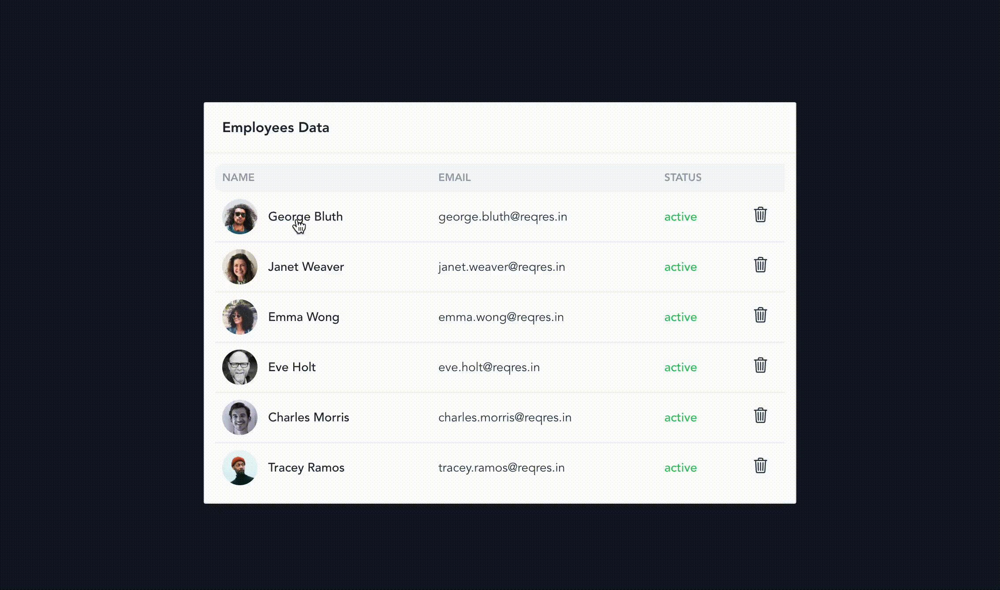

<h1 align="center">Welcome to vue-users 👋</h1>
<p>
  
  <a href="https://github.com/ngocsangyem/vue-users#readme" target="_blank">
    
  </a>
  <a href="https://github.com/ngocsangyem/vue-users/graphs/commit-activity" target="_blank">
    
  </a>
  <a href="https://github.com/ngocsangyem/vue-users/blob/main/LICENSE" target="_blank">
    
  </a>
  <a href="https://twitter.com/ngocsangyem" target="_blank">
    
  </a>
</p>

> A small app to manage users API from [https://reqres.in/](https://reqres.in/).



## Features

|                                               |     |
| --------------------------------------------- | --- |
| [Vue3](https://vuejs.org/)                    | ✅   |
| [Typescript](https://www.typescriptlang.org/) | ✅   |
| [Pinia](https://pinia.vuejs.org/)             | ✅   |
| [Vue router](https://router.vuejs.org/)       | ✅   |
| [Tailwind](https://tailwindcss.com/)          | ✅   |
| [Vercel](https://vercel.com/)                 | ✅   |

### 🏠 [Homepage](https://github.com/ngocsangyem/vue-users#readme)

### ✨ [Demo](https://vue-users-omega.vercel.app/)

## Install

```sh
npm install
```

## Usage

```sh
npm run dev
```

## Production

```sh
npm run build
```

## Recommended IDE Setup

- [VSCode](https://code.visualstudio.com/) + [Volar](https://marketplace.visualstudio.com/items?itemName=johnsoncodehk.volar)

## Type Support For `.vue` Imports in TS

Since TypeScript cannot handle type information for `.vue` imports, they are shimmed to be a generic Vue component type by default. In most cases this is fine if you don't really care about component prop types outside of templates. However, if you wish to get actual prop types in `.vue` imports (for example to get props validation when using manual `h(...)` calls), you can enable Volar's Take Over mode by following these steps:

1. Run `Extensions: Show Built-in Extensions` from VSCode's command palette, look for `TypeScript and JavaScript Language Features`, then right click and select `Disable (Workspace)`. By default, Take Over mode will enable itself if the default TypeScript extension is disabled.
2. Reload the VSCode window by running `Developer: Reload Window` from the command palette.

You can learn more about Take Over mode [here](https://github.com/johnsoncodehk/volar/discussions/471).

## Author

👤 **ngocsangyem**

- Website: <https://www.ngocsangyem.dev/>
- Twitter: [@ngocsangyem](https://twitter.com/ngocsangyem)
- Github: [@ngocsangyem](https://github.com/ngocsangyem)
- LinkedIn: [@ngocsangyem](https://linkedin.com/in/ngocsangyem)

## 🤝 Contributing

Contributions, issues and feature requests are welcome!<br />Feel free to check [issues page](https://github.com/ngocsangyem/vue-users/issues). You can also take a look at the [contributing guide](https://github.com/ngocsangyem/vue-users/blob/main/CONTRIBUTING.md).

## Show your support

Give a ⭐️ if this project helped you!

<a href="https://www.patreon.com/ngocsangyem">
  
</a>

## Todo

- Add tests
- Refactor update user information

## 📝 License

Copyright © 2022 [ngocsangyem](https://github.com/ngocsangyem).<br />
This project is [ISC](https://github.com/ngocsangyem/vue-users/blob/main/LICENSE) licensed.
